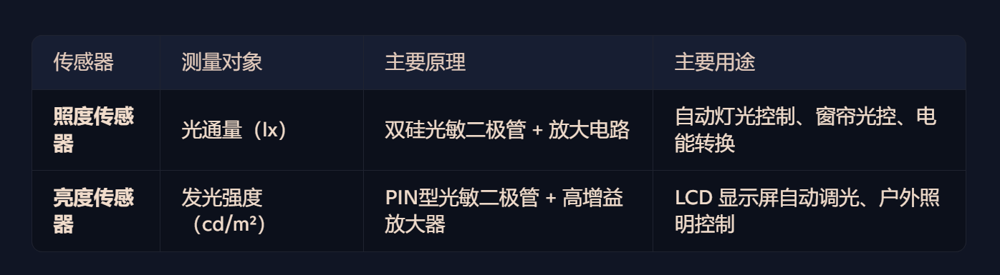

# 物联网感知与控制技术 练习作业

# **教材一：现代传感器技术—面向物联网应用（第二版）**

## 第一章（P5）：1-5，1-11；

【1-5】传感器一般由哪些部分组成？简述各部分的功能，指出哪些是必需的。

敏感元件(必须)：它的功能是直接感受被测量并输出与之有确定关系的另一类物理量。

转换元件(必须)：将敏感元件的输出量需要转换为电量

转换电路：如果转换元件输出的信号微弱，或者不是易于处理的电压或电流信号，而是其他电量，则需要相应转换电路将其转换为易于传输、转换、处理和显示的形式

辅助电源：提供传感器正常工作所需能量的电源部分

【1-11】物联网用传感器一般有哪些共性要求或特点？应用于野外环境监测的无线传感器一般还应主要注重哪些要求？

性价比高、尺寸小、低功耗外，从提高性能和方便使用考虑，网络化测量的接口和采用智能化方式 ,  还需确保准确性和可靠性。

野外：环境恶劣：可靠性高，抗干扰；电能、带宽受限：节能、数据量小

## 第二章（P34）：2-3，2-6，2-8，2-14；

【2-3】传感器的静态特性是什么？主要由哪些性能指标描述？

静态特性表示传感器在被测量处于稳定状态时的输出与输入关系，主要指标包括灵敏度、线性度、迟滞和重复性、分辨力与阈值、稳定性、精度等。

【2-6】如何根据传感器产品给出的精度等性能指标合理选择量程？

线性范围即传感器输出与输入成正比的范围。线性范围越宽，量程越大，在量程内能保证给定的传感器测量精度。所以，确定传感器类型后，先看量程是否满足要求，并考虑使传感器尽量处于最佳工作段，估计输入量可能发生突变时的过载量。实际中可将非线性误差及其他误差满足测量要求的一定范围视为传感器的线性范围。

【2-8】采用差动测量技术（差动组合）对改善传感器性能有何意义？

采用差动测量技术对改善传感器性能的意义主要体现在以下几点： （AI）

1. **提高线性度**：差动技术可以显著减小非线性误差，使输出更接近线性关系 。
2. **增强灵敏度**：通过抵消零位输出和偶次非线性项，灵敏度可提高一倍 。
3. **抑制共模干扰**：有效消除温度变化、电源波动等共模误差，提升抗干扰能力 。
4. **改善分辨率**：差动结构设计能检测更微小的信号变化，提高分辨率 。
5. **降低噪声影响**：通过对称信号相减，减少噪声干扰，提高信噪比 。

【2-14】如何合理选择传感器？选择传感器的过程一般从哪个环节开始？

选用的三条选择：1.整体需要原则。2.高可靠性原则。3.高性价比原则

(1) 根据测量对象和适用条件确定传感器类型
(2) 线形范围与量程
(3) 灵敏度 
(4) 精度
(5) 频率响应范围特性
(6) 稳定性 

## 第三章（P64）：3-2，3-3，3-4；

【3-2】测量电阻有哪些常见方法？各适用于何种情况？

（1）偏转法。 简单快速测量 ， 用于线形传感器电阻(偏转法适用情况为GPT4o提供)

（2）分压法。分压器方法常用于测量阻值变化范围很大的传感器，以及非线性传感器的电阻。

（3）电桥法。惠斯通电桥常用于测量小阻值变化。

【3-3】对于单臂敏感电阻工作的电桥，采用不平衡电压作为输出时，该检测电路的灵敏度与敏感电阻的变化程度有何种关系？什么情况下灵敏度最高？

该检测电路的灵敏度与敏感电阻的变化程度成正比关系。

1.电源电压较高
2.检流计内阻较小
3.电桥接近平衡状态

【3-4】要改进单臂工作的测量电桥的灵敏度并且同时消减非线性，常采用什么测量工作方式？说明应如何布置敏感电阻才能达到目的，并分析说明该方式是否可以补偿温度影响。（AI总结）

常采用全桥测量方式。四个桥臂均由应变片组成，​通过对称布置使其分别感应拉应变和压应变，从而增强输出信号并提高线性度。

是因为四个应变片使用相同材料并对称布置，温度变化引起的电阻变化在电桥中相互抵消，使得电桥输出主要反映应变变化，而不是温度漂移。

## 第四章：(P126)：4-3；4-9；4-10；4-12，4-13；4-14。

【4-3】金属应变片与半导体应变片在工作原理上有何异同？比较应变片与应变片敏感材料的灵敏系数概念的不同物理意义。（AI）

**相同点**：两者均基于材料受力变形（应变）导致电阻变化，用于测量应变或应力。

**不同：** 几何形变和压阻效应 , 半导体应变片的灵敏度系数高，但它在温度稳定性及重复性方面则不如金属电阻应变片。

灵敏系数（K）的物理意义比较

金属应变片：K约等于2（主要由几何变形贡献，电阻率变化极小）。

半导体应变片：K可达50~200（主要来自压阻效应，电阻率变化主导）。

【4-9】什么是热电效应和热释电效应？热式电探测器有何特点？

把两种不同金属或半导体串接成闭合回路，当两节点处温度不同时，在回路中将产生热电动势并产生回路电流，这种由温差产生热电势的现象称为热电效应。

晶体材料受温度变化影响，其晶格的原子排列发生变化，能产生自发极化，在晶面上将产生电荷，表现出自发极化，此现象称为热释电效应。

热释电探测器特点如下：可在室温下工作，但使用温度必须低于热释电元件材料的居里点：属交流器件，对恒定辐射无响应，恒定辐射须经调制斩波转换为交流或使用脉冲辐射：属高阻抗器件，需使用高阻抗低噪声的阻抗变换器如FET或电荷放大器。

【4-10】简述热电偶的测温原理和方法。产生热电势需要满足什么条件？（AI）

当两种不同金属导体（或半导体）组成闭合回路，且两连接端（**热端**和**冷端**）存在**温度差（ΔT）**时，回路中会产生**热电势（E）**，其大小与温度差成正比，可用于温度测量。（和书本大致相同）

1. **材料差异**：必须由两种不同的导体（或半导体）组成回路。
2. **温度梯度**：热端与冷端必须存在温度差（ΔT ≠ 0）。
3. **闭合回路**：热电偶需形成闭合电路（开路时无法产生电流，但可测量电势）。

【4-12】什么是外光电效应、内光电效应？什么是光电导效应和光伏效应？各列举一两例基于这几个效应的对应器件。

金属在光照射下光电子逸出金属表面的现象称为外光电效应。

物体受到光照时，其内部原子释放的电子留在物体内部，使物体的电导率发生变化或产生光生电动势的效应称为内光电效应。内光电效应分为光电导效应和光生伏特效应两大类。

光电导效应。入射光强改变物质电导率的物理现象称为光电导效应。

光生伏特效应。在一定条件下半导体受光照射产生电动势的现象称为光生伏特效应

（AI生成表）

| **效应类型** | **物理过程**   | **典型器件**     |
| ------------------ | -------------------- | ---------------------- |
| 外光电效应         | 电子逸出材料表面     | 光电倍增管、光电管     |
| 光电导效应         | 光照改变材料电导率   | 光敏电阻、HgCdTe探测器 |
| 光伏效应           | 光照在结区产生电势差 | 太阳能电池、光电二极管 |

【4-13】光电器件主要特性有哪些？各起何作用？如何根据光电器件的特性选配光源？ （AI）

光照特性 表征光电器件的灵敏度，反映输入光量与输出电流或电压之间的关系。

光谱特性 描述光电器件的相对灵敏度与入射光波长之间的关系。

响应时间 反映光电器件的动态特性，即对光信号变化的响应速度。

峰值探测率 表示光电器件在特定波长下的最高探测能力。

温度特性 描述温度变化对光电器件灵敏度和光谱特性的影响。

伏安特性 反映光电器件的电流-电压关系，影响其工作状态和输出信号。

确保光源的波长与光电器件的光谱响应范围匹配。
根据应用需求选择光源的光强和调制速度，以满足光电器件的光照特性和响应时间要求。
在特殊环境下（如高温、低温），选择温度稳定性好的光源和光电器件组合。
考虑光电器件的峰值探测率，选择发射波长接近峰值的光源以提高效率。

【4-14】什么是霍尔效应？霍尔元件为何容易受温度影响？如何补偿环境温度变化对霍尔器件输出的影响？ （AI）

将导体或半导体薄片置于均匀磁场中，沿薄片长度方向通入控制电流时，将在宽度方向上产生一个横向电场，这一电场称为霍尔电场，产生的相应电势称为霍尔电势，这种现象称为霍尔效应。

**半导体材料的电阻率、迁移率和载流子浓度等参数会随着温度的变化而变化**，进而导致霍尔传感器的内阻和霍尔电势也发生变化。

常用方法：恒流供电、输入端并联电阻；恒压供电，并联或串联热敏电阻

## 第五章：(P177)：5-1；5-4；5-18； 5-26。

【5-1】非接触式大位移霍尔传感器的测量精度一般是由小磁钢的等分精度（即磁场排列的节距）决定的，在此基础上可以有何方法进一步提高测距精度？ （照书上瞎写的）

正交信号细分技术：如题中所述，可采用4组8片AMR电阻组成两个电桥，输出相位差为90°的正弦和余弦电压信号，通过细分或插值计算处理，将一个磁极节距分解为更精细的测量单位。

高精度信号处理算法：

通过FFT或小波变换等数字信号处理技术分析磁场波形
应用插值算法实现亚周期分辨率
使用神经网络等智能算法补偿非线性误差

多传感器融合技术：

采用多个霍尔元件组成传感器阵列
将多个传感器的信号综合处理，降低随机误差
通过加权平均等算法提高测量稳定性

精密模拟前端设计：

优化放大器电路减少噪声干扰
采用高分辨率ADC提高数字转换精度
实现动态增益调整以适应不同距离条件

温度补偿机制：

集成温度传感器监测工作环境
建立温度-输出特性数学模型进行实时补偿
减少温度漂移对测量精度的影响

【5-4】简述光学三角位置传感器的原理和特点。是否可以利用该传感器测量速度？适合于何种类型或运动方式的速度测量？

光学三角位置传感器利用传感器发射的光束和被测物反射光束之间的几何关系来决定物体的位置。

光源发出的光通过聚光透镜照到被测物或者被测物的反光靶上，再经过接收透镜把被测物反射的光传到位置敏感元件上。位置敏感元件一般采用CCD或CMOS图像传感器或PSD（光位置敏感器件）等。由光位敏器件检测出反射光成像点相对所设参考点的偏移量x，通过简单的三角关系可算出被测体（反光靶）相对传感器设定的参考位置的偏移，从而算出被测体到传感器的距离L

光学三角位置传感器通过连续测量目标物体的位置变化来计算速度，适合于低速直线运动、周期性往复运动以及某些旋转运动的测量。然而，对于高速运动或复杂轨迹运动，其适用性受到一定限制。(AI)

【5-18】比较并说明光电式、磁电式和霍尔式转速传感器测速性能的异同点。要测量在恶劣环境中转动的车轮速度宜选哪一种转速传感器？ （AI）

### **光电式、磁电式与霍尔式转速传感器的测速性能比较**

| **特性**       | **光电式转速传感器**   | **磁电式转速传感器**     | **霍尔式转速传感器**     |
| -------------------- | ---------------------------- | ------------------------------ | ------------------------------ |
| **工作原理**   | 光信号反射/透射转换为电脉冲  | 磁场变化感应电动势（电磁感应） | 霍尔效应检测磁场变化           |
| **精度**       | 高（分辨率可达每转数千脉冲） | 中低（低速时精度较差）         | 中高（需温度补偿提高精度）     |
| **响应速度**   | 快（适合高速测量）           | 较慢（低速性能差）             | 快（适合中高速测量）           |
| **抗干扰能力** | 易受污染、强光干扰           | 抗电磁干扰能力弱               | 抗电磁干扰较强                 |
| **环境适应性** | 要求清洁、无尘环境           | 耐油污、粉尘，但怕强磁场       | 耐油污、粉尘、高温（IP65防护） |
| **安装要求**   | 需对准反射/透射标记          | 需靠近齿轮或磁性目标           | 需靠近磁钢或导磁齿轮           |
| **成本**       | 较高                         | 较低                           | 中等                           |

### **恶劣环境下车轮测速的推荐选择**

**霍尔式转速传感器**是最佳选择，原因如下：

1. **高环境适应性**：IP65防护等级，耐油污、粉尘、潮湿。
2. **抗干扰能力强**：相比磁电式，霍尔传感器受电磁干扰较小。
3. **非接触测量**：无机械磨损，寿命长。
4. **适用宽温度范围**：部分型号支持-40℃~125℃工作环境。

**结论**：**霍尔式传感器**综合性能最优，特别适合车辆、工业机械等恶劣环境下的转速测量。

【5-26】采用应变片的力传感器如何消减环境温度变化对其输出的影响？（AI）

可以采用全桥或半桥差动电路，利用相邻桥臂应变片的温度效应相互抵消；
或选用温度系数与试件材料匹配的专用应变片

在试件上粘贴与工作片相同的补偿片（不受力）并接入桥路相邻臂，仅感受温度变化

## 第六章：(P197)：6-2；6-8；6-12；6-13。

【6-2】简述PN结温度传感器的工作原理。（AI）

PN结温度传感器利用半导体PN结的正向压降随温度变化的特性实现温度测量。当给PN结施加恒定正向电流时，其正向导通电压会随着温度升高而近似线性地下降，典型温度系数约为-2mV/℃。这一现象主要由半导体材料的禁带宽度随温度变化以及本征载流子浓度增加所导致。在恒定电流偏置下，PN结的正向电压与温度成反比关系，通过精确测量这个电压变化即可确定环境温度。

【6-8】热电阻按引线的不同分为两线制、三线制和四线制。这样的设置出于何种原因？各适用于什么场合？三线制电阻应如何接入测量电桥电路才能起到有效作用？（AI）

电阻引线制式的不同设置主要是为了消除引线电阻对测量精度的影响。两线制结构简单但引线电阻会引入显著误差，适用于测量精度要求不高的场合；三线制通过增加补偿引线可抵消引线电阻的影响，是工业现场最常用的方式，特别适合中等精度要求的温度测量；四线制采用独立的电流引线和电压检测引线，完全消除引线电阻干扰，主要用于实验室等高精度测量场合。对于三线制热电阻接入测量电桥，应将两根材质、长度相同的引线分别接入电桥相邻的两个桥臂，第三根引线接至电源端，这样引线电阻变化会相互抵消，确保电桥输出仅反映热电阻的阻值变化。这种接法能有效抑制环境温度变化引起的引线电阻波动对测量结果的影响。

【6-12】当某热电偶高温端为1000℃时，低温端结点为50℃，试计算在此热电偶上产生的热电势。假设该热电偶在1000C时的热电势为E1000=36.25mV，50C时的热电势为E50=1.41 mV。（AI）

根据热电偶的测温原理，当热端温度为1000℃、冷端温度为50℃时，回路中产生的有效热电势（E）等于高温端热电势与低温端热电势之差。计算如下：

$$
E=E_{1000}−E_{50}=36.25 mV−1.41 mV=34.84 mV
$$

【6-13】电桥是热电阻和热敏电阻的常用测量电路，使用时应注意哪些问题？（AI）

1. **引线电阻补偿**

   三线制/四线制接法消除长导线电阻影响，二线制仅适合短距离测量。
2. **温度系数匹配**

   选择与传感器温度特性匹配的桥臂电阻（如铜电阻配铜补偿电阻）。
3. **非线性校正**

   热敏电阻需分段线性化或软件补偿其指数特性。
4. **电磁干扰防护**

   采用屏蔽线并远离强磁场/电场，必要时添加滤波电路。
5. **桥压稳定性**

   使用精密基准源供电，电压波动会直接导致测量误差。
6. **冷端补偿**

   热电阻测量时需补偿环境温度变化（如PT100配专用IC）。

新增计算题：见PPT：6-热学量传感器.pdf 第7页
例：已知铂电阻温度计，0°C时电阻为100Ω，100°C时电阻为120Ω，当它与热介质接触时，电阻值增至140Ω，试确定该介质温度。
计算公式：

$$
R_t＝R_0[1+α(t−t_0)]
$$

其中R0，t0分别为0度时电阻和温度(t0 = 0)
本题计算方法：先由0°C和100°C算出α：`120 = 100(1+α(100-0))`
然后，在设T：`140 = 100(1+α(T-0))`

## 第七章：(P220)：7-6；7-7；7-9。

【7-6】常见的实用红外探测器有哪些类型？各有何特点？有哪些工业应用？

常见的实用化热探测器主要有三种类型：热释电型、热敏电阻型、热电堆型。

①热释电型探测器。它在热探测器中探测率最高，频率响应最宽。这种探测器根据热
释电效应制成，其电压响应率正比于入射光辐射率变化的速率。
200

②热敏电阻型探测器。它根据探测器吸收射入的红外辐射能后产生温升，由热敏电阻
感测。大多数探测器内设两个敏感元件，一个作为工作片，测量受光面的温升；另一个作
为补偿片，感受环境温度。两个热敏元件与两个固定电阻组成测量电桥。

③热电堆型探测器。它由多个相同的微型热电偶串联而成，使同样的温差可获得成
倍的热电势输出。它将微型热电偶的工作端密集排列在很小的面积上，入射光经透镜会聚
照射在工作端上，冷端分布在外围遮光部位。利用薄膜技术制作微型热电偶，可将大量的
工作端集成在很小的面积上，如TPS334-L5.5型热偶型热电探测器，敏感面只有0.7×
0.7mm²，灵敏度典型值可达55V/W，时间常数为25ms，还设有进行冷端温度补偿的热
敏电阻。

工业应用 ： 红外感烟探测器(火灾报警), 红外吸收式气体传感器(测量气体浓度)

【7-7】简述紫外光探测器的工作原理与用途。

紫外光探测器的工作原理基于光电效应和气体电离现象。当紫外线透过石英玻璃照射到探测器的阴极时，涂敷在阴极上的电子放射材料会释放光电子。在强电场的作用下，光电子被吸引至阳极，并在运动过程中与管内气体分子碰撞，产生更多的电子和离子。最终，这些电子和离子在阴极与阳极之间形成辉光放电，使电路产生显著电流。当没有紫外线照射时，阴极和阳极之间不会有电子流动，表现出高阻抗状态。

在火灾报警系统中，它能快速检测火焰产生的紫外线，为宾馆、饭店、仓库、公寓和办公楼提供早期预警。

【7-9】分析光亮度传感器和光照度传感器的异同，举例说明这两种传感器的用途。

## 第八章：(P240)：8-7；8-8。

【8-7】电阻型湿敏器件是如何敏感湿度的？半导体湿敏电阻为何要使用加热器？ `AI`

电阻型湿敏器件通过吸湿材料的电阻变化来感知湿度。它的核心结构包含一个能够吸收水分的敏感层，例如高分子材料或陶瓷材料。当环境湿度发生变化时，水分子会进入或离开这一敏感层，导致其电导率或电阻率发生变化。随着水分子的吸附，材料中的自由离子浓度增加，降低电阻值；而在干燥环境下，离子减少，电阻增大。通过测量电阻变化，就可以推算出环境的相对湿度。

半导体湿敏电阻通常使用加热器来提高测量稳定性和延长器件寿命。加热器的作用主要包括：防止水分凝结，避免电极短路；加快湿敏材料的吸湿与脱湿过程，提高响应速度；减少环境污染物对湿敏材料的影响，确保测量精准度。此外，适度加热还能提升湿敏电阻在低温或高湿环境下的稳定性，使其适用于更广泛的工业和气象应用。

【8-8】电容式湿敏元件的特性有哪些？主要适用于哪些领域和场合？

电容式湿敏元件采用平板电容器结构，其中核心部分是感湿膜，它由高分子聚合物制成，能够吸收环境中的水分并改变其介电常数。由于电容值与介电常数成正比，感湿膜的变化会直接影响元件电容量，从而实现湿度测量。相比于高分子电阻式湿敏元件，电容式湿敏元件具有更广的测湿范围（0～100%RH）、较好的线性输出、较小的湿滞回差，并且响应速度快、温度稳定性高，适用于高精度湿度检测场合。

由于其高精度和稳定性，电容式湿敏元件广泛应用于国防科研、军用设施、气象监测、医疗卫生以及工业过程控制等领域。

## 第12章：(P399)：12-2；12-5。

【12-2】如果需要设计一个可靠性高的室内火灾探测报警器，一般需要使用哪些相关的传感器？若希望能探测到早期火灾信号，应选择何种参量传感器及其类型？

为设计一个可靠性高的室内火灾探测报警器，通常需要使用以下几种相关的传感器：烟雾报警传感器、热敏型感温传感器以及燃气泄漏传感器。烟雾报警传感器能及早检测到烟雾，通过测量环境中的烟雾浓度来触发报警；热敏型感温传感器能检测环境温度及其变化，特别是在火灾初期阶段能够快速响应；燃气泄漏传感器则能探测到可燃气体，如厨房中的天然气泄漏，确保火灾安全防范的全面性。

若希望能探测到早期火灾信号，需要选择检测烟雾浓度和环境温度变化这两种参量的传感器。对应的传感器类型分别是离子型感烟传感器或光电型感烟传感器（用于烟雾浓度检测），以及热敏型感温传感器（用于环境温度变化检测）。这类传感器能在火灾初期（如阴燃、低热辐射阶段）及时发现烟雾或温度异常，从而提前报警，有效防止火灾蔓延。

【12-5】测量土壤湿度有哪些测量原理的传感器？

常见的测量原理包括时域反射法（TDR）、时域传播法（TDT）、频域反射法（FDR）、驻波比法（SWR）、高频电容探头法、甚高频晶体传输线振荡器法、微波吸收法等。其中，TDR 和 FDR 以及某些电容法是最常用的技术，它们通过测量土壤的介电常数（电容）来推算土壤水分含量。水的介电常数远高于空气和土壤固体颗粒，因此水分变化会显著影响土壤的介电特性。通过测量介电常数的变化，即可得到土壤的体积含水量。FDR 传感器通常采用多个探头，可深入地下进行测量，并具备非接触测量能力，在农业和环境监测领域广泛应用。

## 自学章节：（1）P371页12.2传感器节点典型解决方案举例（两个例子）

12.2.1一种可持续监测振动的低功耗无线传感器节点方案

12.2.2一种灌区监测无线传感器网络节点方案

12.2.3一种穿戴式健康监护传感器节点方案

（我也不懂怎么考，把大标题弄出来了。不会直接填标题吧？）

## （2）P350页  图12-1-1 智能家居系统结构、图12-1-11 可燃性气体检测报警器结构框图 、 图12-1-13 环境监测系统结构。案例图画法

# **教材二：物联网控制技术（第2版）**

## 第三章（P57）：3.10，3.11；

n字长 → 看作n bit 分辨率(我感觉的)

3.10 ：0-1500，3，1500/3 = 500，字长该为9位 2^9 = 512；1500-600 = 900，900/512 = 1.75摄氏度

3.11： 10/0.05 = 200，256，字长为8

## 第五章（P137）：5.6(参考p127页，两种方法)；5.9（参考p129页，用加权平均判决法）；

求模糊关系合成的方法：

首先，都是按照矩阵乘法写出乘积式

1. 和最大，乘最小合成法 ;

   乘数选最小，和选最大得到输出矩阵的方法
2. 和最大 乘积合成法

   乘积就乘，和选最大的方法

加权平均：输出式除变乘相加，再除以原分子之和

## 第七章（P190）：掌握各种数字滤波技术。

1. 均值滤波：多次数据取个平均值
2. 中值滤波：多次数据取个中值
3. 限幅滤波：新数据和旧数据相差过大：yk - yk-1 > Δy，则舍弃该k次值，采用k-1次

4. 惯性滤波：Y(k) = a·Y(k-1) + (1-a)·X(k) 又叫一阶滤波

    (类似动量法更新梯度)

5. 复合滤波：把上面的东西合起来乱搓

    例如 连续采样 N 次 ， 去除最大最小值 ， 然后取平均值 (书里管这叫 平均值法 和 中值法 结合 ， 乐😅 )
