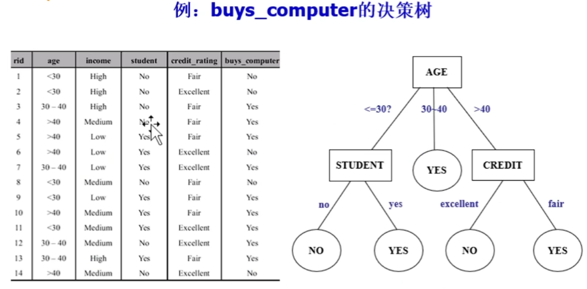

# 物联网数据处理与安全

## **第二讲 数据分析算法**

### 监督性分类算法：C4.5算法

参见https://www.bilibili.com/video/BV1PR4y1r7od

首先来介绍决策树

决策树就是数据结构的一棵树，输入数据后，根据数据属性 判断 出它的结果是什么

例子：银行的决策树，根据用户属性决定是否放贷

问题的关键就在于，怎么可以根据数据把树建起来，而且能得到一颗高质量/高效的决策树 → 选择出最佳的，用于分割的属性

熵的概念(或者称信息量) H(X) = -∑ pi * logpi ；一个属性，所有选项的P*log(1/pi)的和最大，证明这个属性的熵最大，即不确定性最大

而决策树的构建，是需要去除不确定性，最后达到一个固定结果的过程(熵为0)。

ID3构建算法(不考，便于理解)，采用信息增益来选择目前的根属性应该选谁。

H(X)=-∑ pi * logpi
Gain(S, A)=E(S)-E(S, A)

gain某属性下的增益，E(S)是上次熵值，ESA是某个属性A作为根节点后的熵值。第一次算的熵值由结果属性得出。

E(S, A) = 某属性下每一项的结果的熵值 进行平均求和/均值求和

先是天气属性的各个值的熵值，然后进行属性整体平均求和得到该属性为根的熵值，就能算该属性为根的信息增益

C4.5算法，使用信息增益率来选择属性。

$$
信息增益率\ Gain_{radio} = {G(A)\over I}
$$

G(A)就是上面ID3算法算出来的，每个属性的Gain(A)，然后再去除以该属性自身的熵值(求整体均值)，抑制ID3算法对于一个属性有超多分类的强加权

算法总结：

1. 计算类别信息熵，也叫结果信息熵.D
2. 计算每个属性的信息熵：累加每个属性的均值结果信息熵(把结果信息熵的结构套在属性的每一个值，算出来的再取平均)
3. 可求得属性信息增益Gain(属性) =  Info(D) - Info(属性)
4. 计算各属性的信息分裂度量：把类别信息熵的计算套到属性上

$$
5. 信息增益率\ Gain_{radio} = {G(A)\over I}
$$

找到最高增益率，用就完了

## 最后一堂课

### 第一章 ：挑战和机遇：七大挑战，数据安全，大数据人才缺乏……

挑战一：业务部门无清晰的大数据需求

挑战二：内部数据孤岛严重

挑战三：数据可用性低，质量差

挑战四：数据相关管理技术和架构

挑战五：数据安全问题

挑战六：大数据人才缺乏

挑战七：数据开放与隐私的权衡

### 第二章 算法主要看PPT吧

**为什么要做数据的预处理？**

现实世界的数据是“脏的 ”

数据缺失：记录为空&属性为空

数据重复：完全重复&不完全重复

数据错误：异常值&不一致

数据不可用：数据正确，但不可用

**如何预防脏数据出现**

l  制定数据标准

- 统一多数据源的属性值编码
- 尽可能赋予属性名和属性值明确的含义

l  优化系统设计

- 关键属性尽可能采用选项方式，而不是手动填写
- 重要属性出现在醒目的位置，采用必填选项
- 异常值要给出修改提示

**C4.5算法。看置顶**

**KNN算法**

1. 算法实现

    1. 计算测试数据与各个训练数据之间的距离；
    2. 按照距离的递增关系进行排序；
    3. 选取距离最小的K个点；
    4. 确定前K个点所在类别的出现频率；
    5. 返回前K个点中出现频率最高的类别作为测试数据的预测分类。

2.优缺点

1、理论成熟，思想简单，既可以用来做分类也可以用来做回归 ；
2、适合对稀有事件进行分类（例如：客户流失预测）；
3、特别适合于多分类问题(multi-modal,对象具有多个类别标签，例如：根据基因特征来判断其功能分类)， kNN比SVM的表现要好。

缺：

1、当样本不平衡时，如一个类的样本容量很大，而其他类样本容量很小时，有可能导致当输入一个新样本时，该样本的K个邻居中大容量类的样本占多数；
2、计算量较大，因为对每一个待分类的文本都要计算它到全体已知样本的距离，才能求得它的K个最近邻点；
3、可理解性差，无法给出像决策树那样的规则。

**K-MEANS**：实现、优缺点

核心思想：由用户指定k个初始质心，以作为聚类的类别，重复迭代直至算法收敛。

**优点**

（1）简单、快速；

（2）对大数据集有较高的效率并且是可伸缩性的；

（3）时间复杂度近于线性，适合挖掘大规模数据集。

**缺点**

（1）k-means是局部最优，因而对初始质心的选取敏感；

（2）选择能达到目标函数最优的k值是非常困难的。

### 第三章

计算总体架构：数据存储系统、数据处理系统，包括什么？（括号 不需要了）

**数据存储系统**

包括数据采集层、数据清洗、抽取与建模、数据存储架构、数据统一接口等。

**数据处理系统**

针对不同类型数据的计算模型、针对机器学习算法的数据流图模型、 各类分析算法实现、提供各种开发工具包和运行环境的计算平台

### 第四章

哈杜普不考，所以第四章不考

hadoop部署包括什么进程：主节点、从节点运行什么程序

主节点Master：

1. NameNode：用于存储文件系统的目录树、文件元数据和集群中每个文件的位置。
2. Secondary NameNode：代表 NameNode 执行内务任务并记录检查点.
3. ResourceManager：分配和监视可用的集群资源
4. ApplicationMaster：协调在集群上运行的特定应用程序。

从节点Slave/worker

1. Datanode：用于存储和管理本地磁盘上的 HDFS 块
2. NodeManage：在单个节点上运行和管理处理任务

### **第五章**

**HDFS的特点是什么：包括括号**

➢ 透明性（对上层应用程序屏蔽底层平台细节）
➢ 高可用性（HDFS提供容错性和恢复机制）
➢ 支持并发访问（支持多个应用程序并发访问数据）
➢ 可扩展性（可通过增加集群物理设备扩展计算能力、而勿需修改系统软件）
➢ 安全性（数据层独立于应用层，数据安全性不依赖于应用层）

**缺点是什么**

1）不适合低延时数据访问

2）不适合小文件存储

3）不支持文件随机修改

**结构**

➢ Master/Slave体系结构（主/从服务器）
➢ 主控服务器（元数据服务器）：负责管理命名空间和文件目录
➢ 数据服务器（存储服务器）：存储实际文件数据

**HDFS的读流程：6步  考的方式（给图分析流程、或简答题，背**

client打开文件
在namenode获取块信息
向datanode发起读取请求
从datanode读取数据
读取下一个数据块
读取完毕client关闭文件

**写流程：8步**

client 创建文件
在 namenode建立文件元数据
向datanode写入请求
向datanode写入数据包
client接收确认包
关闭文件
结束过程
通知名称节点关闭文件

**HBase与传统关系型数据库相比的特点：5点**

1.更擅长处理非结构画面，半结构化数据。
2.具备很强的横向扩展能力，能够通过在集群中增加或者减少硬件数量来实现计算能力的伸缩。
3.支持高并发读写操作，能很好地与MapReduce计算模型集成。
4.基于列存储结构支持高速访问。
5.与分布式文件系统比较，Hbase支持随机访问模式。

**HBase的数据模型：5点**

以表的形式存储数据
表由行和列族组成
个表可包含若干个列族
一个列族内可用列限定符来标志不同的列
存于表中单元的数据尚需打上时间戳

**HBase存储逻辑视图，根据指令和表格输出数据**

二次索引表不考

第六章

**MapReduce计算原理：分治法：4个小点**

1.将大数据集划分未小数据集，小数据集划分为更小数据集。
2.将最终划分的小数据分布到集群节点上。
3.以并行方式完成计算处理。
4.将计算结果递归融汇，得到最终结果。

**Map数目的计算**

默认情况：map数(default_num) = 总大小/块大小

如果只加上预设map数(goal_num)>默认，则取预设

如果再加上最小分片大小，当min.splite.size>block_size，map取 min(split_num, max(default_num,goal_num))

最后还需考虑不能跨文件，所以final_map_num =	max(compute_map_num,input_file_num)

MapReduce计算流程

1. 用户程序给 master 与 worker 进行程序部署
2. Master 给 worker 分配 map 和 reduce 任务
3. 执行map任务的worker从分片读取数据
4. worker执行完map任务后把结果在本地写数据
5. 执行reduce的worker中间文件从远程读取数据
6. 执行完reduce的worker把结果写数据

### 第七章

**流计算的两种模式，小批次和流处理，计算和比较，延迟和吞吐率  看PPT**

1. **流处理与小批次模式的对比**
   - **流处理模式** ：每条数据单独处理，延迟为 2*Ln*+*Ls*，吞吐率为 1/(2*Ln*+*Ls*)（单位：条/秒）。
   - **小批次模式** ：每批处理10条数据，延迟增加为 2*Ln*+10*Ls*，但吞吐率提升为 10/(2*Ln*+10*Ls*)。虽然延迟增加，但单位时间内处理的数据量（10条）显著提升，整体吞吐率更高 。

- 对于流处理而言：  客户端系统延迟  delay time = 2Ln + Ls

  服务器端系统吞吐率 throughput =  1/(delay time) = 1/(2Ln  + Ls)

  如果我们采用一次把10条数据打成一个包（batch）发送处理的方式，网络传输时间不变， 仍然为2 * network latency，但服务器处理时间变为10 * server latency，因为需要处理 10条数据。
- 对于小批次而言：  客户端系统延迟  delay time = 2Ln + 10Ls

  服务器端系统吞吐率 throughput = 10/(delay time) = 10/(2Ln + 10Ls)= 1/(0.2Ln + Ls)

比较两种模式的delay time和throughput可知，只要Ln  > 0和Ls > 0，则有：  2Ln + Ls  < 2Ln + 10Ls

1/(2Ln + Ls) < 1/(0.2Ln + Ls)

storm框架的特点：5点，不带括号。
分布式：具有水平扩展能力
实时性：对流数据的快速响应处理，响应时延可控制在毫秒级 数据规模：支持海量数据处理，数据规模可达TB甚至PB量级
容错性：提供系统级的容错和故障恢复机制
简便性：简单的编程模型，支持编程语言如Java，Clojure，Ruby，Python

**图计算：BSP的核心思想及组成部分**

BSP的核心思想是: 将任务分步完成，通过定义SuperStep (超步)来完成任务 的分步计算。也就是将一个大任务分解为一定数量的超步，而在每一个超步内各 计算节点(即组件，Virtual Processor代表) 独立地完成本地的计算任务，将计 算结果进行本地存储和远程传递以后，在全局时钟的控制下进入下一个超步。

**bsp模型组成部分**

组件：每个组件又路由器和存储器组成。
路由器：用于实现各组件之间点对点的消息传递。
全局时钟：用于同步全部或部分的组件。

第八章

Spark的功能框架：6部分。写出英文和1句简介

Shark SQL：SQL查询引擎。

Spark Core：内存计算模型。

Spark Streaming：流计算支持单元。

GraphX：Spark的图并行计算框架

MLBase：支持机器学习的组件库

第九章  安全肯定有一道题

物联网安全和互联网安全的不同：6点

①加密机制实施难度大
②认证机制难以统一
③访问控制更加复杂
④网络管理难以准确实施
⑤网络边界难以划分
⑥设备难以统一管理

物联网的安全特征 一二三

**一是感知网络的信息采集、传输与信息安全问题**

**二是核心网络的传输与信息安全问题。**

**三是物联网业务的安全问题。**
